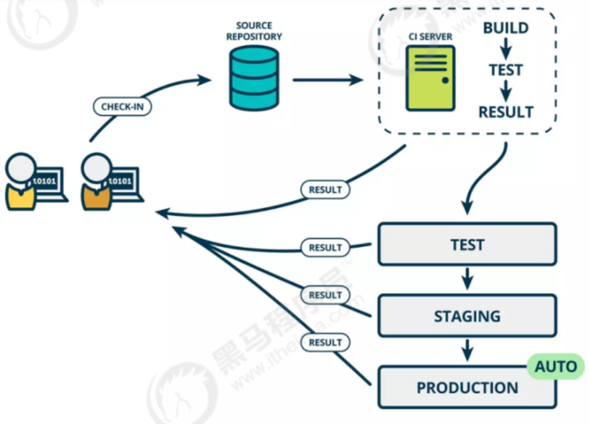

# 使用GitLab+Docker+Jenkins实现项目自动化部署

项目地址
git@gitlab.com:growing-bald/gitlab-docker-jenkins.git

[TOC]

## 背景

### 软件开发生命周期

> 软件开发生命周期又叫**SDLC**(Software Development Life Cycle)，它是集成了计划、开发、测试和部署过程的集合

需求分析 -》 设计 -》实现 -》 测试 -》 进化

### 软件的敏捷开发

> 敏捷开发的核心是**迭代开发**和**增量开发**

#### 迭代开发

​	迭代开发将开发过程拆分为多个小周期，即一次"大开发"变成多次"小开发"，每次小开发都是同样的流程，所以看上去好像重复在做同样的步骤。

#### 增量开发

​	软件的每个版本，都会新增一个用户可以感知的完善功能。也就是说，按照新增功能来划分迭代。

#### 敏捷开发的好处

+ 早期交付：持续交付可以减少资金压力
+ 降低风险：及时了解市场需求

### 什么是持续集成

> 持续集成（ Continuous integeration , 简称CI ）指的是：频繁地（一天多次）将代码集成到主干

#### 持续集成的目的

​	可以让产品**快速迭代**，同时**保持高质量**。它的核心措施是，将代码集成到主干之前，必须通过自动化测试。只要有一个测试用例失败。就不能集成。

#### 持续集成的好处

​	通过持续集成，团队可以快速的从一个功能到另一个功能。

​	简而言之，敏捷开发很大一部分要归功于持续集成。

#### 持续集成流程



提交  -》 测试（第一轮） -》 构建 -》 测试（第二轮，可不测） -》 部署 -》 回滚（发生问题）

#### 持续集成的组成要素

+ 持续集成服务器
+ 代码存储仓库，可用于版本控制
+ 一个自动构建过程，自动化完成检出代码、编译构建、运行测试、结果记录、测试统计

## Jenkins

​	Jenkins是一款流行的开源持续集成工具，广泛用于项目开发，具有自动化构建、测试和部署等功能。

### Jenkins持续集成流程


1. 开发人员提交代码到版本控制仓库
2. Jenkins作为持续集成工具，拉取代码到集成服务器，再配合JDK、Maven等软件完成代码编译、代码测试和审查、测试、打包等工作
3. 代码编译成功后，Jenkins把生成的jar或war包分发到测试服务器或生产服务器，测试人员或用户就可以访问使用

### Jenkins持续集成环境配置

```java
//todo
```

#### Jenkins登录密码

```txt
admin
HengTian0.0
```

#### Jenkins较新的数据源

```sh
https://mirrors.tuna.tsinghua.edu.cn/jenkins/updates/update-center.json 
```

#### Maven安装路径

```sh
/usr/local/apache-maven-3.5.4 #maven_home
/usr/local/maven/repo	#maven仓库
```

```txt
JenkinsHook
11b8f797685d1a118a838cbd78f3dab044
http://JENKINS_URL/generic-webhook-trigger/invoke.
refs/heads/master_[a-zA-Z0-9-]{1,}(?!yh)
$ref_$project_$username
```

#### jenkins -- Generic Webhook Trigger插件

