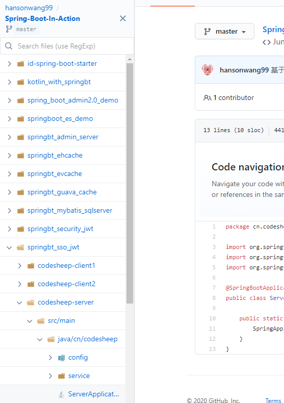
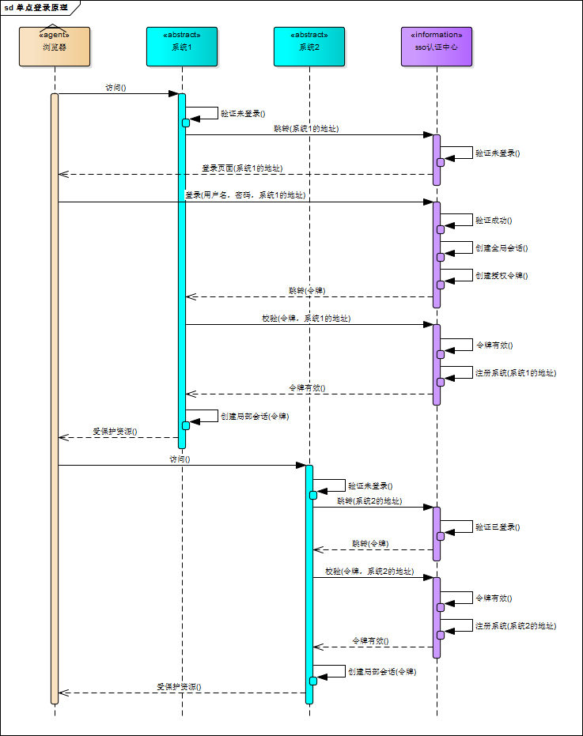

链接：

https://blog.csdn.net/weixin_42873937/article/details/82460997?utm_medium=distribute.pc_relevant.none-task-blog-title-3&spm=1001.2101.3001.4242

https://www.cnblogs.com/Eleven-Liu/p/10336181.html


### 1. SSO

在企业发展初期，企业使用的系统很少，通常一个或者两个，每个系统都有自己的登录模块，运营人员每天用自己的账号登录，很方便。但随着企业的发展，用到的系统随之增多，运营人员在操作不同的系统时，需要多次登录，而且每个系统的账号都不一样，这对于运营人员来说，很不方便。于是，就想到是不是可以在一个系统登录，其他系统就不用登录了呢？这就是单点登录要解决的问题。

单点登录英文全称Single Sign On，简称就是SSO。它的解释是：**在多个应用系统中，只需要登录一次，就可以访问其他相互信任的应用系统。**


### 2. 什么是CAS

`CAS`全称为`Central Authentication Service`即中央认证服务；

> CAS分为 Server和 Client两部分。
>
> Server负责用户的认证工作，就像是把第一次登录用户的一个标识存在这里，以便此用户在其他系统登录时验证其需不需要再次登录。
>
> CAS Client就是我们自己开发的应用程序，需要接入Server端。当用户访问我们的应用时，首先需要重定向到Server端进行验证，要是原来登陆过，就免去登录，重定向到下游系统，否则进行用户名密码登陆操作。

从结构上看，CAS 包含两个部分： CAS Server 和 CAS Client。CAS Server 需要独立部署，主要负责对用户的认证工作；CAS Client 负责处理对客户端受保护资源的访问请求，需要登录时，重定向到 CAS Server。


### 3. JWT

JSON Web Token（JWT）是一个开放标准（RFC 7519），它定义了一种紧凑且独立的方式，可以在各方之间作为JSON对象安全地传输信息。此信息可以通过数字签名进行验证和信任。JWT可以使用秘密（使用HMAC算法）或使用RSA或ECDSA的公钥/私钥对进行签名。
虽然JWT可以加密以在各方之间提供保密，但只将专注于签名令牌。签名令牌可以验证其中包含的声明的完整性，而加密令牌则隐藏其他方的声明。当使用公钥/私钥对签署令牌时，签名还证明只有持有私钥的一方是签署私钥的一方。

通俗来讲，JWT是一个含签名并携带用户相关信息的加密串，页面请求校验登录接口时，请求头中携带JWT串到后端服务，后端通过签名加密串匹配校验，保证信息未被篡改。校验通过则认为是可靠的请求，将正常返回数据。

#### 什么情况下使用JWT比较适合

- 授权：这是最常见的使用场景，解决单点登录问题。因为JWT使用起来轻便，开销小，服务端不用记录用户状态信息（无状态），所以使用比较广泛；
- 信息交换：JWT是在各个服务之间安全传输信息的好方法。因为JWT可以签名，例如，使用公钥/私钥对 - 可以确定请求方是合法的。此外，由于使用标头和有效负载计算签名，还可以验证内容是否未被篡改。

#### JWT的结构体

JWT由三部分组成，分别是头信息、有效载荷、签名，中间以（.）分隔，如下格式：

```
xxx.yyy.zzz
```

**header（头信息）**
由两部分组成，令牌类型（即：JWT）、散列算法（HMAC、RSASSA、RSASSA-PSS等），例如：

```json
{
  "alg": "HS256",
  "typ": "JWT"
}
```

然后，这个JSON被编码为Base64Url，形成JWT的第一部分。

**Payload（有效载荷）**
JWT的第二部分是payload，其中包含claims。claims是关于实体（常用的是用户信息）和其他数据的声明，claims有三种类型： registered, public, and private claims。
**Registered claims：** 这些是一组预定义的claims，非强制性的，但是推荐使用， iss（发行人）， exp（到期时间）， sub（主题）， aud（观众）等；
**Public claims:** 自定义claims，注意不要和JWT注册表中属性冲突，[这里可以查看JWT注册表](https://www.iana.org/assignments/jwt/jwt.xhtml)
**Private claims:** 这些是自定义的claims，用于在同意使用这些claims的各方之间共享信息，它们既不是Registered claims，也不是Public claims。
**以下是payload示例：**

```json
{
  "sub": "1234567890",
  "name": "John Doe",
  "admin": true
}
```

然后，再经过Base64Url编码，形成JWT的第二部分；

*注意：对于签名令牌，此信息虽然可以防止篡改，但任何人都可以读取。除非加密，否则不要将敏感信息放入到Payload或Header元素中。*

**Signature**
要创建签名部分，必须采用编码的Header，编码的Payload，秘钥，Header中指定的算法，并对其进行签名。
例如，如果要使用HMAC SHA256算法，将按以下方式创建签名：

```java
HMACSHA256(
  base64UrlEncode(header) + "." +
  base64UrlEncode(payload),
  secret)
```

签名用于验证消息在此过程中未被篡改，并且，在使用私钥签名令牌的情况下，它还可以验证JWT的请求方是否是它所声明的请求方。
输出是三个由点分隔的Base64-URL字符串，可以在HTML和HTTP环境中轻松传递，与SAML等基于XML的标准相比更加紧凑。
例如：

```
eyJhbGciOiJIUzI1NiIsInR5cCI6IkpXVCJ9.
eyJzdWIiOiIxMjM0NTY3ODkwIiwibmFtZSI6IkpvaG4gRG9lIiwiaWF0IjoxNTE2MjM5MDIyfQ.
SflKxwRJSMeKKF2QT4fwpMeJf36POk6yJV_adQssw5c
```

#### JWT工作机制

在身份验证中，当用户使用其凭据成功登录时，将返回JSON Web Token（即：JWT）。由于令牌是凭证，因此必须非常小心以防止出现安全问题。一般情况下，不应将令牌保留的时间超过要求。理论上超时时间越短越好。

每当用户想要访问受保护的路由或资源时，用户代理应该使用Bearer模式发送JWT，通常在Authorization header中。标题内容应如下所示：

```
Authorization: Bearer <token>
```

在某些情况下，这可以作为无状态授权机制。服务器的受保护路由将检查Authorization header中的有效JWT ，如果有效，则允许用户访问受保护资源。如果JWT包含必要的数据，则可以减少查询数据库或缓存信息。
如果在Authorization header中发送令牌，则跨域资源共享（CORS）将不会成为问题，因为它不使用cookie。

*注意：使用签名令牌，虽然他们无法更改，但是令牌中包含的所有信息都会向用户或其他方公开。这意味着不应该在令牌中放置敏感信息。*

#### 使用JWT的好处

相比**Simple Web Tokens (SWT)（简单Web令牌）** and **Security Assertion Markup Language Tokens (SAML)（安全断言标记语言令牌）**；

- JWT比SAML更简洁，在HTML和HTTP环境中传递更方便；
- 在安全方面，SWT只能使用HMAC算法通过共享密钥对称签名。但是，JWT和SAML令牌可以使用X.509证书形式的公钥/私钥对进行签名。与签名JSON的简单性相比，使用XML数字签名可能会存在安全漏洞；
- JSON解析成对象相比XML更流行、方便。

***

Github目录树工具：

[Gitako-Github file tree](https://github.com/EnixCoda/Gitako)



#### 4. Spring Security + JWT

[参考](https://www.codesheep.cn/2019/03/14/security-jwt-hibernate/)

[代码](https://github.com/hansonwang99/Spring-Boot-In-Action/tree/master/springbt_security_jwt)

#### 5.SpringSecurity + OAUTH2 + JWT

基于Spring Security Oauth2的SSO单点登录+JWT权限控制实践

[参考](https://www.codesheep.cn/2019/05/07/springbt-sso-jwt/)

[代码](https://github.com/hansonwang99/Spring-Boot-In-Action/tree/master/springbt_sso_jwt)

***



